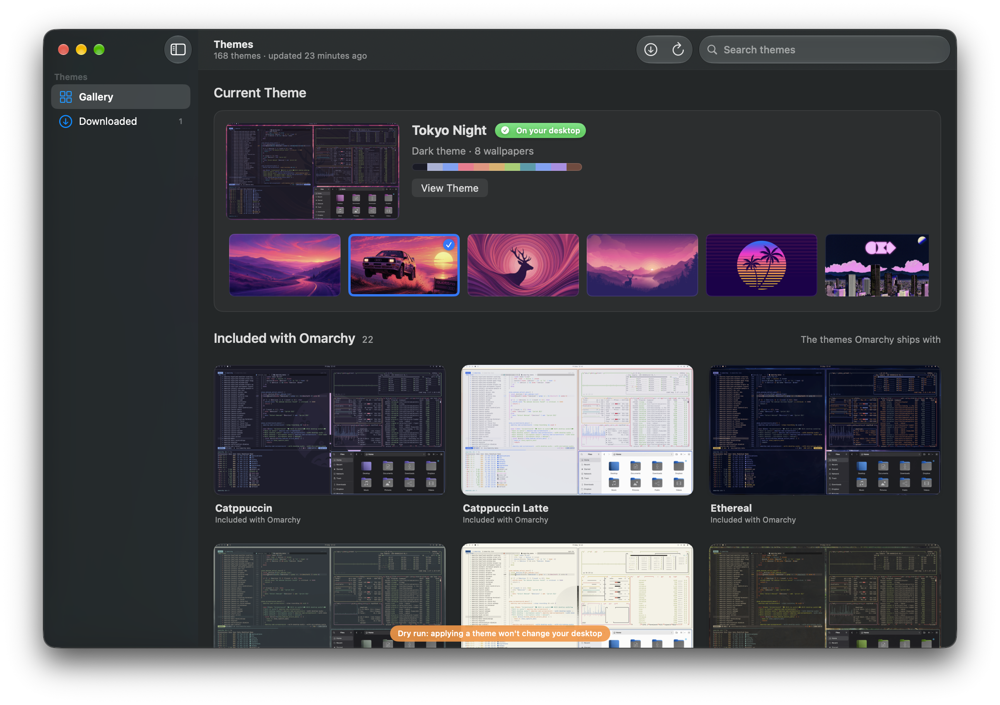

<p align="center">
  
</p>

<h1 align="center">Omarchy Themes</h1>

<p align="center">
  Browse the <a href="https://omarchy.org">Omarchy</a> themes and bring their wallpapers and colors<br>
  to your Windows or Mac desktop.
</p>

<p align="center">
  <a href="https://omarchy.org/themes/">Theme gallery</a>
  &nbsp;·&nbsp;
  <a href="https://github.com/basecamp/omarchy">Omarchy on GitHub</a>
  &nbsp;·&nbsp;
  <a href="#building-on-windows">Build for Windows</a>
  &nbsp;·&nbsp;
  <a href="#building-on-macos">Build for macOS</a>
  &nbsp;·&nbsp;
  <a href="docs/ARCHITECTURE.md">How it works</a>
</p>

<p align="center">
  
</p>

A native desktop companion for [Omarchy Themes](https://omarchy.org/themes/).
[Omarchy](https://omarchy.org) is by DHH. 

| Platform | Stack | Status |
|---|---|---|
| Windows 10 (19041+) / 11 | WinUI 3 · Windows App SDK 2.5 · .NET 10 | Working v0.1 (`windows/`) |
| macOS 14+ | SwiftUI · Swift 6 · XcodeGen | Working v0.1 (`macos/`) |

## Building on Windows

Requirements: Windows 10 19041+ and the **.NET 10 SDK**. Nothing else: the Windows App SDK comes from
NuGet and the app runs unpackaged.

```bash
cd windows
dotnet build OmarchyThemes.sln
dotnet run --project src/OmarchyThemes.App
dotnet test
```

## Building on macOS

Requirements: macOS 14+, Xcode 16 or later (Swift 6), and [XcodeGen](https://github.com/yonaskolb/XcodeGen)
(`brew install xcodegen`).

```bash
cd macos
xcodegen                              # generates OmarchyThemes.xcodeproj
xcodebuild -scheme OmarchyThemes -derivedDataPath build/DerivedData build
cd OmarchyThemesKit && swift test
```

## How it works

Architecture, how the catalog is read and themes are applied on each platform, test switches, logs and
the test suites are in [docs/ARCHITECTURE.md](docs/ARCHITECTURE.md).
