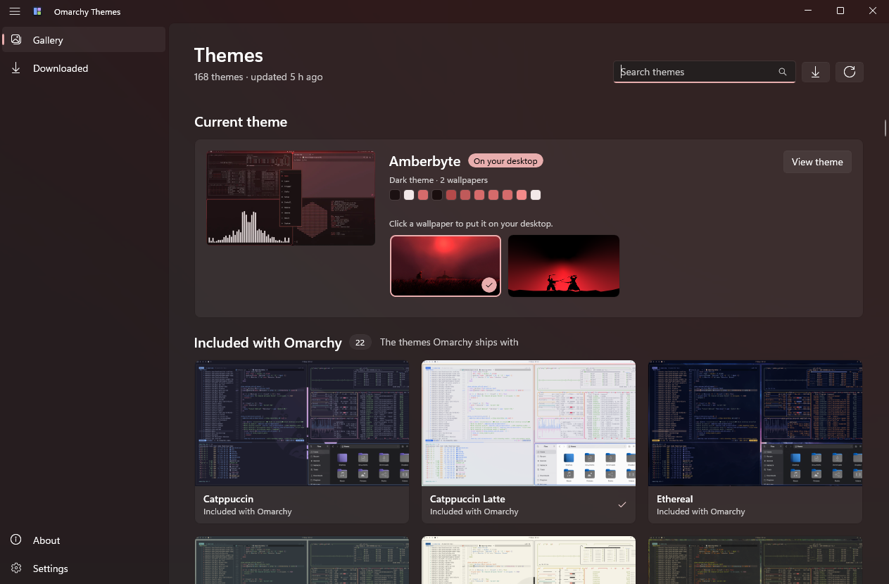

<p align="center">
  
</p>

<h1 align="center">Omarchy Themes</h1>

<p align="center">
  Browse the <a href="https://omarchy.org">Omarchy</a> themes and bring their wallpapers and colors<br>
  to your Windows or Mac desktop.
</p>

<p align="center">
  <a href="https://omarchy.org/themes/">Theme gallery</a>
  &nbsp;·&nbsp;
  <a href="https://github.com/basecamp/omarchy">Omarchy on GitHub</a>
  &nbsp;·&nbsp;
  <a href="#building-on-windows">Build for Windows</a>
  &nbsp;·&nbsp;
  <a href="#building-on-macos">Build for macOS</a>
</p>

<p align="center">
  
  <br>
</p>

A native desktop companion for [Omarchy Themes](https://omarchy.org/themes/).
[Omarchy](https://omarchy.org) is by DHH. 

| Platform | Stack | Status |
|---|---|---|
| Windows 10 (19041+) / 11 | WinUI 3 · Windows App SDK 2.5 · .NET 10 | Working v0.1 (`windows/`) |
| macOS 14+ | SwiftUI · Swift 6 · XcodeGen | Working v0.1 (`macos/`) |

## Building on Windows

Requirements: Windows 10 19041+ and the **.NET 10 SDK**. Nothing else. The Windows App SDK and the
Windows SDK build tools come from NuGet, and the app runs unpackaged + self-contained, so no MSIX
install or Windows App Runtime installer is needed. Visual Studio 2022/2026 with the *WinUI
application development* workload is optional (XAML designer and Hot Reload).

```bash
cd windows
dotnet build OmarchyThemes.sln
dotnet run --project src/OmarchyThemes.App
dotnet test
```

The app project defaults to the host architecture; pass `-p:Platform=ARM64` (or `x64`) to
cross-build. Solution and project builds share one output folder
(`src/OmarchyThemes.App/bin/Debug/net10.0-windows10.0.26100.0/win-x64/`), so `dotnet run` never
launches a stale build.

The same test switches as on macOS:

| Variable | Effect |
|---|---|
| `OMARCHY_THEMES_DRY_RUN=1` | Swaps in a backend that reports Windows' capabilities but changes nothing, so Apply and Restore can be exercised end to end without touching the desktop. The title bar shows a "Dry run" badge. |
| `OMARCHY_THEMES_DATA_DIR=<path>` | Uses another data folder instead of `%LOCALAPPDATA%\OmarchyThemes` (fresh first launch, no risk to real downloads or the saved original desktop). |

Use both whenever the UI is driven by a script:

```powershell
$env:OMARCHY_THEMES_DRY_RUN = '1'; $env:OMARCHY_THEMES_DATA_DIR = "$env:TEMP\omatheme-test"
dotnet run --project src/OmarchyThemes.App
```

Errors and notable events (catalog, default themes, downloads, apply, restore) are logged to
`logs\omarchy-themes-yyyyMMdd.log` in the data folder (kept for a week) and to the debugger output.

## Building on macOS

Requirements: macOS 14+, Xcode 16 or later (Swift 6), and [XcodeGen](https://github.com/yonaskolb/XcodeGen)
(`brew install xcodegen`). SwiftSoup (HTML parsing) is the only package dependency and is fetched by SwiftPM.

```bash
cd macos
xcodegen                              # generates OmarchyThemes.xcodeproj
open OmarchyThemes.xcodeproj          # or build from the command line:
xcodebuild -scheme OmarchyThemes -derivedDataPath build/DerivedData build
xcodebuild -scheme OmarchyThemes -derivedDataPath build/DerivedData test

cd OmarchyThemesKit && swift test     # the package alone, no Xcode project needed
```

Two environment variables help when testing the app:

| Variable | Effect |
|---|---|
| `OMARCHY_THEMES_DRY_RUN=1` | Swaps in a backend that changes nothing, so Apply and Restore can be exercised without touching the desktop. The window shows a "Dry run" badge. |
| `OMARCHY_THEMES_DATA_DIR=<path>` | Uses another data folder instead of `~/Library/Application Support/OmarchyThemes` (e.g. a fresh first launch). |

`GITHUB_TOKEN` (or `OMARCHY_THEMES_GITHUB_TOKEN`) raises the GitHub rate limit, as on Windows. Apps
started from the Finder don't inherit your shell's environment, so set it with `launchctl setenv` or
run the app binary from a terminal.

## Architecture (macOS)

The macOS app is its own SwiftUI codebase following macOS conventions: a `NavigationSplitView`
sidebar (Gallery, Downloaded) with drill-in detail pages, a unified toolbar with search and refresh
(⌘R), a `Settings` window (⌘,), the standard About panel with credits, and "Show Welcome Screen"
in the Help menu.

- **OmarchyThemesKit** ports Core's behaviour (not its code) and has no AppKit: the catalog
  parser (SwiftSoup instead of AngleSharp), the ETag HTTP cache over a small `HTTPTransport`
  protocol (URLSession in the app, a routing fake in tests), the GitHub client, the palette parsers
  (a strict TOML reader for the subset palette files use, with the same lenient line-scanner
  fallback), `ThemeResolver`, `ThemeStore`, `ThemeApplier` and `ApplySummary`.
- **OmarchyThemesMac** implements `DesktopBackend` (`MacDesktopBackend`) behind a `WallpaperAPI`
  protocol, so it's tested without changing the desktop.
- **App** holds an `@Observable` `AppModel` (services, catalog state, downloads that carry on
  when you navigate away) and the views.

Local data lives in `~/Library/Application Support/OmarchyThemes`, with the same layout as on
Windows (`cache/`, `themes/<slug>/`, `settings.json`, `original-desktop.json`,
`original-desktop/`). Screenshot and wallpaper thumbnails are cached in `cache/images/`.

### Applying a theme on macOS

| Aspect | Mechanism |
|---|---|
| Wallpaper | `NSWorkspace.setDesktopImageURL(_:for:options:)` for every `NSScreen`. Fill, Fit, Stretch and Center map to `imageScaling` + `allowClipping`; the theme's background color is passed as `fillColor` for the area around the image. WebP and BMP wallpapers are converted to PNG with ImageIO first (into a hidden `.converted` folder next to the file), because it's undocumented whether the desktop displays them. |
| Light / dark | Not supported: macOS has no public API for an app to change the system appearance. The Apply sheet shows it disabled, with a link to Appearance settings. |
| Accent color | Not supported, for the same reason. |

Safety is the same as on Windows. Nothing changes on launch, and nothing changes until you apply a
theme. Before the first Apply, each screen's desktop picture and options are saved, along with a
private copy of each picture (except the built-in ones under `/System`, which are always there).
**Restore my original desktop** in Settings puts them back, falling back to the private copy if the
original file is gone. A display connected after the snapshot gets the main display's picture. If
the snapshot can't be taken, nothing is applied.

Known limitations:

- `setDesktopImageURL` changes the **current Space** on each display, not every Space.
- Dynamic and Aerial (video) wallpapers are restored as the picture file the system reports, which
  may be a still image.
- Removing a downloaded theme deletes its wallpapers, including the one on your desktop; the
  confirmation says so.

## Architecture (Windows)

- **Core** holds all logic that doesn't touch the OS, so it's unit-tested without Windows:
  catalog parsing, GitHub repo resolution with an ETag cache, palette parsers, the on-disk theme
  store, and `ThemeApplier`, which drives an `IDesktopBackend` abstraction. It also owns
  **downloads** (`ThemeDownloads`, keyed by theme): they outlive the page that started them, so
  leaving a theme mid-download neither cancels nor orphans it, coming back shows the live
  progress, and pressing Download again joins the running download. Concurrent lookups of one
  theme share a single GitHub request (`ThemeDetailsService`).
- **Platform.Windows** implements `IDesktopBackend` (`WindowsDesktopBackend`). Each OS touchpoint
  sits behind a small interface (`IRegistryAccess`, `IWallpaperApi`, `ISettingsBroadcaster`,
  `IImageConverter`) so the backend is tested without changing the machine it runs on.
- **App** is the WinUI 3 UI (MVVM with CommunityToolkit.Mvvm, DI via
  Microsoft.Extensions.DependencyInjection).

Local data lives in `%LOCALAPPDATA%\OmarchyThemes`:

```
cache/                  HTTP cache (catalog page, GitHub trees, palette files) + ETags
themes/<slug>/          theme.json manifest, wallpapers/, screenshot
settings.json           welcome seen, one-click apply defaults, last applied theme
original-desktop.json   snapshot taken before the first Apply
original-desktop/       private copies of the original wallpapers, used by Restore
logs/                   daily log files, kept for a week
```

### Applying a theme on Windows

Everything is per-user (HKCU) and needs no elevation.

| Aspect | Mechanism |
|---|---|
| Wallpaper | `IDesktopWallpaper::SetBackgroundColor` (the theme's `background`, so Fit/Center wallpapers are framed in the theme's color instead of black) + `SetPosition` (the chosen fit) + `SetWallpaper(NULL, path)` for every monitor, on an STA thread; `SystemParametersInfoW(SPI_SETDESKWALLPAPER)` fallback. WebP and other formats are first converted to PNG with WIC (`BitmapDecoder`/`BitmapEncoder`). |
| Light / dark | `HKCU\Software\Microsoft\Windows\CurrentVersion\Themes\Personalize` `AppsUseLightTheme` + `SystemUsesLightTheme`, then `WM_SETTINGCHANGE("ImmersiveColorSet")` via `SendMessageTimeout(SMTO_ABORTIFHUNG)` |
| Accent color | `HKCU\…\DWM` `AccentColor` (ABGR) + `ColorizationColor`/`ColorizationAfterglow` (ARGB); `HKCU\…\Explorer\Accent` `AccentPalette` (8 × RGBA shades), `AccentColorMenu`, `StartColorMenu`; `HKCU\Control Panel\Desktop` `AutoColorization=0`; then the same broadcast. Near-black or near-white accents are lifted to a readable lightness first. |

Safety:

- Nothing changes on launch or until the user picks a theme and applies it.
- Before the first Apply, the backend snapshots every registry value it may touch (including
  "value was absent") and each monitor's wallpaper. It keeps a private copy of each wallpaper
  file, because Windows' `TranscodedWallpaper` is overwritten by the next wallpaper change.
  **Restore my original desktop** writes the values back (deleting ones that didn't exist before)
  and restores the per-monitor wallpapers, fit and desktop fill color (which is system-wide).
- If the snapshot can't be taken, nothing is applied.

Known limitations:

- **Accent color:** Windows has no public API for it. The values above mirror what the Settings
  app stores, and most surfaces pick them up from the broadcast, but some only refresh after
  signing out and back in. The UI says so.
- **Restoring a slideshow or Windows Spotlight background** puts back the image that was showing
  when the snapshot was taken, not the slideshow itself.
- **WebP wallpapers** need the WebP codec. It's built into Windows 11; on Windows 10 it comes with
  the "WebP Image Extensions" Store package. The error message says so if it's missing.

### Adding a new platform theming API

1. Add a capability to `DesktopCapabilities` in Core, along with the matching method on
   `IDesktopBackend`.
2. Teach `ThemeApplier` when to call it (it gates every step on the backend's capabilities and on
   the user's Apply options), and extend `DesktopSnapshot` if the setting should be restorable.
3. Implement it in the platform backend (`Platform.Windows`, or the macOS app's equivalent) and
   report the capability. On Windows, add any registry values it writes to
   `WindowsDesktopBackend.TrackedValues` so they're snapshotted and restored automatically. Put
   new Win32/COM entry points in `NativeMethods.txt` (CsWin32 generates the bindings).
4. Add a checkbox to the Apply dialog and a toggle in Settings (`ApplyOptions` in Core).
5. Add tests: a `ThemeApplier` test with the fake backend, and a `WindowsDesktopBackendTests`
   case asserting exactly which values are written.
